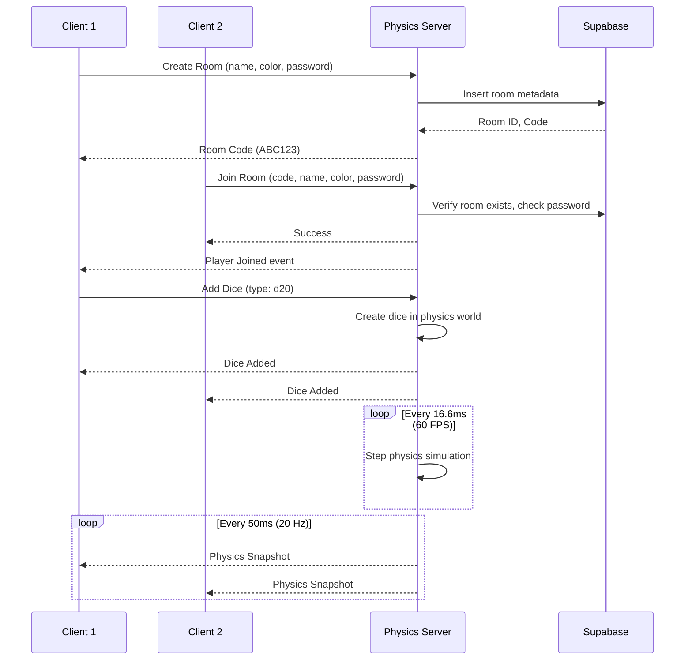

# Multiplayer Architecture - Daisu Dice Simulator

Complete guide to the multiplayer system architecture, setup, and implementation.

---

## 📋 Overview

The multiplayer system enables real-time physics synchronization between players in shared rooms using:

- **Authoritative Server**: Node.js physics server with Rapier (60 FPS simulation)
- **Client Prediction**: Local physics prediction for responsiveness
- **WebSocket Communication**: Socket.io for low-latency state updates (20 Hz broadcast)
- **Room Management**: Supabase for persistent room metadata and authentication

---

## 🏗️ Architecture

```
┌──────────────────────────────────────────────────────────────────┐
│                         CLIENT (React)                            │
│                                                                   │
│  ┌────────────┐    ┌──────────────┐    ┌──────────────────┐     │
│  │  React     │◄──►│  Multiplayer │◄──►│  Socket Manager  │     │
│  │ Components │    │    Store     │    │   (Socket.io)    │     │
│  └────────────┘    └──────────────┘    └──────────────────┘     │
│         │                  │                      │              │
│         v                  v                      v              │
│  ┌────────────┐    ┌──────────────┐    ┌──────────────────┐     │
│  │   Dice     │◄──►│ DiceManager  │    │    Supabase      │     │
│  │  Manager   │    │    Store     │    │     Client       │     │
│  └────────────┘    └──────────────┘    └──────────────────┘     │
└──────────────────────────────────────────────────────────────────┘
                              │
                              │ WebSocket (Socket.io)
                              │
┌──────────────────────────────────────────────────────────────────┐
│                    PHYSICS SERVER (Node.js)                       │
│                                                                   │
│  ┌────────────┐    ┌──────────────┐    ┌──────────────────┐     │
│  │  Socket    │◄──►│     Room     │◄──►│    Physics       │     │
│  │  Server    │    │   Manager    │    │     World        │     │
│  └────────────┘    └──────────────┘    └──────────────────┘     │
│         │                  │                      │              │
│         │                  v                      v              │
│         │          ┌──────────────┐    ┌──────────────────┐     │
│         │          │   Supabase   │    │      Rapier      │     │
│         │          │   (Rooms DB) │    │  Physics Engine  │     │
│         │          └──────────────┘    └──────────────────┘     │
└──────────────────────────────────────────────────────────────────┘
```

---

## 📂 Project Structure

```
dicesuki/
├── src/                          # Client-side code
│   ├── multiplayer/
│   │   ├── SocketManager.ts      # Socket.io connection manager
│   │   ├── useMultiplayer.ts     # React hook for multiplayer
│   │   └── README.md             # Client multiplayer docs
│   ├── store/
│   │   ├── useMultiplayerStore.ts    # Multiplayer state management
│   │   └── useDiceManagerStore.ts    # Dice state (existing)
│   └── lib/
│       └── supabase.ts           # Supabase client setup
│
├── server/                       # Physics server
│   ├── src/
│   │   ├── index.ts              # Server entry point
│   │   ├── config.ts             # Configuration loading
│   │   ├── physics/
│   │   │   ├── PhysicsWorld.ts   # Rapier world manager
│   │   │   └── DiceSimulator.ts  # Individual dice physics
│   │   ├── room/
│   │   │   └── RoomManager.ts    # Room lifecycle management
│   │   ├── network/
│   │   │   ├── SocketServer.ts   # Socket.io server
│   │   │   └── EventHandlers.ts  # Client event handlers
│   │   └── types/
│   │       └── index.ts          # TypeScript types
│   ├── package.json
│   └── README.md                 # Server documentation
│
├── supabase/                     # Database
│   ├── migrations/
│   │   └── 001_initial_schema.sql    # Database schema
│   └── README.md                 # Supabase setup guide
│
├── deployment/                   # Deployment
│   ├── README.md                 # Oracle Cloud deployment guide
│   └── setup-server.sh           # Automated setup script
│
└── MULTIPLAYER.md                # This file
```

---

## 🚀 Quick Start

### 1. Database Setup (Supabase)

```bash
# 1. Create Supabase project at supabase.com
# 2. Run migration in SQL Editor
# 3. Get API credentials

# See: ./supabase/README.md
```

### 2. Physics Server Setup

```bash
cd server

# Install dependencies
npm install

# Configure environment
cp .env.example .env
# Edit .env with Supabase credentials

# Run development server
npm run dev

# Or build for production
npm run build
npm start
```

**Server runs on:** `http://localhost:3001`

**See:** `./server/README.md`

### 3. Client Setup

```bash
# Install dependencies (includes @supabase/supabase-js and socket.io-client)
npm install

# Configure environment
# Create .env.local in project root:
echo "VITE_SUPABASE_URL=https://xxxxx.supabase.co" >> .env.local
echo "VITE_SUPABASE_ANON_KEY=your_anon_key" >> .env.local
echo "VITE_PHYSICS_SERVER_URL=http://localhost:3001" >> .env.local

# Run dev server
npm run dev
```

**See:** `./src/multiplayer/README.md`

### 4. Deploy to Oracle Cloud (Free)

```bash
# Follow deployment guide
# See: ./deployment/README.md

# Or use automated script:
chmod +x deployment/setup-server.sh
scp deployment/setup-server.sh ubuntu@<VM_IP>:~/
ssh ubuntu@<VM_IP>
./setup-server.sh
```

---

## 🎮 How It Works

### Room Flow



### Physics Synchronization

**Server Authority** (60 FPS):
- Runs Rapier physics simulation
- Handles all collisions
- Detects dice results
- Enforces ownership rules

**Client Updates** (20 Hz):
- Server broadcasts physics snapshots
- Clients interpolate positions
- Local dice: predict movement locally
- Remote dice: render interpolated positions

**Client Prediction** (for local dice):
- Client predicts physics immediately
- Server sends authoritative state
- Client reconciles differences
- Smooth correction via lerp/slerp

---

## 🔧 Configuration

### Physics Server

**`server/.env`:**

```bash
NODE_ENV=production
PORT=3001

SUPABASE_URL=https://xxxxx.supabase.co
SUPABASE_SERVICE_ROLE_KEY=eyJhbG...

PHYSICS_TICK_RATE=60           # Server simulation rate (FPS)
BROADCAST_TICK_RATE=20         # Client update rate (Hz)

MAX_PLAYERS_PER_ROOM=8
MAX_DICE_PER_ROOM=32
ROOM_IDLE_TIMEOUT=300000       # 5 minutes
```

### Client

**`.env.local`:**

```bash
VITE_SUPABASE_URL=https://xxxxx.supabase.co
VITE_SUPABASE_ANON_KEY=eyJhbG...
VITE_PHYSICS_SERVER_URL=http://localhost:3001
```

---

## 📡 Network Events

### Client → Server

```typescript
// Room management
socket.emit('room:create', { playerName, playerColor, password, maxPlayers })
socket.emit('room:join', { roomCode, playerName, playerColor, password })
socket.emit('room:leave')

// Dice actions
socket.emit('dice:add', { type: 'd20', position, rotation })
socket.emit('dice:remove', diceId)
socket.emit('dice:impulse', { diceId, impulse, torque })
socket.emit('dice:drag', { diceId, targetPosition })
```

### Server → Client

```typescript
// Room events
socket.on('room:joined', (data) => { /* Joined successfully */ })
socket.on('room:player_joined', (player) => { /* New player */ })
socket.on('room:player_left', (playerId) => { /* Player left */ })

// Physics updates (20 Hz)
socket.on('physics:snapshot', (snapshot) => {
  snapshot.dice.forEach(dice => {
    // Update dice positions
  })
})

// Dice events
socket.on('dice:added', (dice) => { /* Dice added */ })
socket.on('dice:removed', (diceId) => { /* Dice removed */ })

// Errors
socket.on('error', (error) => { /* Handle error */ })
```

---

## 🗄️ Database Schema

### `rooms` Table

| Column | Type | Description |
|--------|------|-------------|
| `id` | UUID | Primary key |
| `code` | VARCHAR(6) | Short code (ABC123) |
| `password_hash` | TEXT | bcrypt hash (nullable) |
| `max_players` | INT | Default 8 |
| `current_players` | INT | Auto-updated via trigger |
| `is_active` | BOOLEAN | Soft delete |
| `created_at` | TIMESTAMPTZ | Creation time |
| `expires_at` | TIMESTAMPTZ | Auto-cleanup (24h) |

### `room_players` Table

| Column | Type | Description |
|--------|------|-------------|
| `room_id` | UUID | FK to rooms |
| `player_id` | UUID | Player UUID (guest or auth) |
| `player_name` | VARCHAR(50) | Display name |
| `player_color` | VARCHAR(7) | Hex color (#3b82f6) |
| `is_guest` | BOOLEAN | Guest vs. authenticated |
| `joined_at` | TIMESTAMPTZ | Join time |

**See:** `./supabase/migrations/001_initial_schema.sql`

---

## 🧪 Testing

### Local Testing (2 Windows)

1. **Start server:**
   ```bash
   cd server && npm run dev
   ```

2. **Start client:**
   ```bash
   npm run dev
   ```

3. **Open two browser windows:**
   - Window 1: Create room → Get code
   - Window 2: Join room with code
   - Add dice in both windows
   - Verify synchronization

### Network Simulation

Chrome DevTools → Network → Throttling:
- **Good 3G**: Test mobile connection
- **Slow 3G**: Test high latency
- **Offline**: Test reconnection

---

## 📊 Performance

### Resource Usage

**Per Room (8 players, 32 dice):**
- **CPU**: ~20% of 1 core
- **Memory**: ~80-100 MB
- **Bandwidth**: ~880 KB/s (per room)

**Oracle Cloud Free Tier (2 cores, 12GB RAM):**
- **Max Concurrent Rooms**: 10-15
- **Max Players**: 80-120

### Optimization Tips

1. **Reduce tick rate** (if CPU-bound):
   ```bash
   PHYSICS_TICK_RATE=30  # Instead of 60
   ```

2. **Reduce broadcast rate** (if bandwidth-bound):
   ```bash
   BROADCAST_TICK_RATE=10  # Instead of 20
   ```

3. **Limit dice** (if memory-bound):
   ```bash
   MAX_DICE_PER_ROOM=20  # Instead of 32
   ```

---

## 🔒 Security

### Server-Side Validation

- ✅ Input validation (name length, color format)
- ✅ Ownership checks (can only control your dice)
- ✅ Rate limiting (prevent spam)
- ✅ Room capacity enforcement
- ✅ Password protection (bcrypt hashing)

### Client-Side

- ✅ CORS configured (restrict origins in production)
- ✅ Supabase RLS (row-level security)
- ✅ Service role key kept secret (server-only)
- ✅ SSL/TLS for production (wss://)

---

## 🐛 Troubleshooting

### Common Issues

**"Cannot connect to server"**
- Check: Is server running? (`curl http://localhost:3001/health`)
- Check: Firewall allows port 3001
- Check: `VITE_PHYSICS_SERVER_URL` in `.env.local`

**"Dice positions not syncing"**
- Check: `physics:snapshot` events received (console log)
- Check: Server tick rate (60 FPS)
- Check: Network latency (>500ms may cause issues)

**"Room code not found"**
- Check: Room created successfully (server logs)
- Check: Room not expired (24h TTL)
- Check: Supabase connection (check `rooms` table)

**"High memory usage"**
- Reduce `MAX_DICE_PER_ROOM`
- Check for memory leaks (pm2 monit)
- Restart server: `pm2 restart daisu-physics`

---

## 📚 Documentation

- **Supabase Setup**: `./supabase/README.md`
- **Physics Server**: `./server/README.md`
- **Client Multiplayer**: `./src/multiplayer/README.md`
- **Deployment**: `./deployment/README.md`
- **Main Project**: `./CLAUDE.md` (development guide)

---

## 🛣️ Roadmap

### Phase 1: MVP ✅ (Current)

- [x] Supabase schema
- [x] Physics server boilerplate
- [x] Client-side stores and hooks
- [x] Deployment documentation

### Phase 2: Implementation (Next)

- [ ] Room creation UI
- [ ] Join room UI
- [ ] Player list display
- [ ] Sync dice add/remove with server
- [ ] Disable device motion in multiplayer

### Phase 3: Physics Sync

- [ ] Client-side prediction
- [ ] Server reconciliation
- [ ] Interpolation for remote dice
- [ ] Ownership-based controls

### Phase 4: Polish

- [ ] Connection status UI
- [ ] Error notifications
- [ ] Room code sharing (copy button)
- [ ] Password protection UI
- [ ] Loading states

### Phase 5: Advanced

- [ ] Reconnection logic
- [ ] Spectator mode
- [ ] Chat system
- [ ] Room persistence (optional)
- [ ] Analytics

---

## 🙏 Contributing

When working on multiplayer features:

1. **Test locally** with 2+ browser windows
2. **Update documentation** in relevant README files
3. **Follow TDD** approach (write tests first)
4. **Commit incrementally** with clear messages
5. **Update CLAUDE.md** on feature completion

---

## 💡 Tips

### Development

- Use `pm2 logs` to debug server issues
- Use Chrome DevTools Network tab to monitor WebSocket traffic
- Use `pm2 monit` to watch resource usage

### Testing

- Test with high latency (Chrome Network Throttling)
- Test reconnection (toggle Offline mode)
- Test with max players (8) and max dice (32)

### Deployment

- Oracle Cloud Free Tier is sufficient for MVP
- Use PM2 for process management
- Enable SSL/TLS for production (wss://)
- Monitor bandwidth usage (10 TB/month limit)

---

## 📖 Learn More

- [Socket.io Documentation](https://socket.io/docs/v4/)
- [Rapier Physics](https://rapier.rs/docs/)
- [Supabase Documentation](https://supabase.com/docs)
- [Oracle Cloud Free Tier](https://www.oracle.com/cloud/free/)

---

**Happy multiplayer dice rolling! 🎲🎲🎲**
